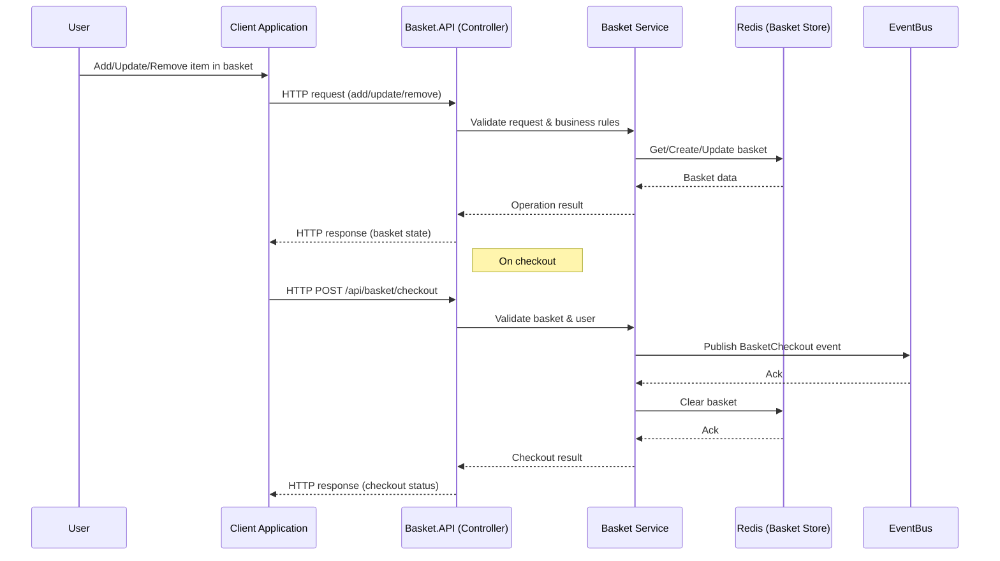
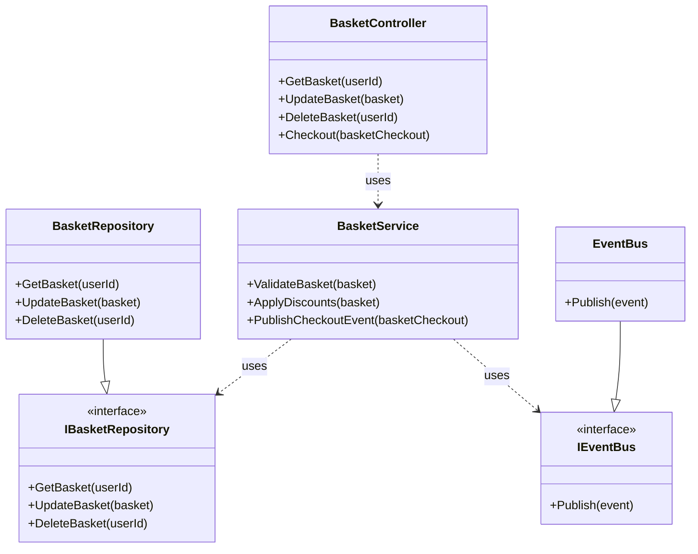

# Basket.API Feature Documentation

## 1. Feature Overview

Basket.API provides a centralized shopping basket management service for the eShop application. It enables users to add, update, and remove items from their shopping basket, persist basket state, and synchronize basket data across devices and sessions. The API is designed to support seamless shopping experiences, enabling features like promotions, discounts, and integration with checkout and ordering systems.

**Business Motivation:**
- Enhance user experience by allowing persistent, cross-device shopping baskets.
- Enable marketing and sales strategies through basket-based promotions.
- Support a scalable, microservices-based e-commerce architecture.

**Key Stakeholders:**
- End users (shoppers)
- Marketing and sales teams
- E-commerce platform administrators
- Developers and system integrators


## 2. Business Implementation Details

## Sequence Diagram: Basket API Flow



- **Business Rules:**
  - Each user has a unique basket identified by user ID.
  - Items can be added, updated (quantity/attributes), or removed.
  - Basket is automatically created if it does not exist when accessed.
  - Supports clearing the basket and applying discounts or coupons.
- **Use Cases:**
  - User adds/removes products to/from basket.
  - User updates item quantities or attributes.
  - Basket is retrieved for checkout or order processing.
  - Basket is cleared after successful order placement.
- **Assumptions/Constraints:**
  - Basket data is ephemeral and may be cleared after inactivity or order completion.
  - Basket size and item count may be limited for performance.


## Class Dependency Diagram



## 3. Technical Implementation Details

- **API Endpoints:**
  - `GET /api/basket/{userId}`: Retrieve basket for a user.
  - `POST /api/basket`: Create or update a basket.
  - `DELETE /api/basket/{userId}`: Delete a user's basket.
  - `POST /api/basket/checkout`: Initiate checkout for a basket.

- **Request/Response Examples:**

  **Retrieve Basket**
  ```json
  // GET /api/basket/johndoe
  {
    "userId": "johndoe",
    "items": [
      { "productId": "p1", "productName": "Widget", "quantity": 2, "unitPrice": 10.0 }
    ],
    "total": 20.0
  }
  ```

  **Update Basket**
  ```json
  // POST /api/basket
  {
    "userId": "johndoe",
    "items": [
      { "productId": "p1", "quantity": 3 }
    ]
  }
  ```

- **Key Classes/Modules:**
  - `BasketController`: API entry point for basket operations ([source](./Basket.API/Controllers/BasketController.cs))
  - `IBasketRepository`, `BasketRepository`: Data access abstraction and implementation
  - `Basket`: Domain model for user basket
  - `BasketCheckout`: Model for checkout operation
  - `IntegrationEvents`: Publishes events for basket checkout and updates

- **Database/Storage:**
  - Uses Redis or similar in-memory store for basket persistence
  - Basket data schema: userId, items (productId, quantity, price, etc.)

- **Integration Points:**
  - Publishes checkout events to EventBus for order processing
  - Consumes product and discount information from Catalog and Discount APIs

## 4. Validation and Error Handling

- **Input Validation:**
  - Validates userId, productId, and item quantities
  - Ensures basket and items exist before update/delete
- **Error Handling:**
  - Returns 404 if basket not found
  - Returns 400 for invalid input (e.g., negative quantity)
  - Publishes error events for failed checkouts
- **Retry/Fallback:**
  - Implements retry logic for transient storage or event bus failures

## 5. Security and Access Control

- **Authentication:**
  - Requires JWT or OAuth2 token for all endpoints
- **Authorization:**
  - Users can only access their own basket
- **Data Access Restrictions:**
  - Basket data is scoped to authenticated user

## 6. Testing Strategy

- **Unit Tests:**
  - Cover controller logic, repository methods, and validation
- **Integration Tests:**
  - Test API endpoints with in-memory or test Redis
- **Acceptance Tests:**
  - End-to-end scenarios for basket lifecycle
- **Tools/Frameworks:**
  - xUnit, Moq, TestServer

## 7. Deployment Considerations

- **Feature Flags:**
  - Basket features can be toggled via configuration
- **Infrastructure:**
  - Requires Redis or compatible cache
  - EventBus configuration for integration events
- **Post-Deployment:**
  - Monitor basket API health and event delivery
  - Validate integration with checkout/order systems

## 8. References

- [BasketController.cs](./Basket.API/Controllers/BasketController.cs)
- [IBasketRepository.cs](./Basket.API/Repositories/IBasketRepository.cs)
- [BasketRepository.cs](./Basket.API/Repositories/BasketRepository.cs)
- [Basket.cs](./Basket.API/Model/Basket.cs)
- [BasketCheckout.cs](./Basket.API/Model/BasketCheckout.cs)
- [IntegrationEvents](./Basket.API/IntegrationEvents/)
- [API Specification (Swagger)](./Basket.API/swagger/index.html)
- [Related Pull Requests](https://github.com/auropro/automated-doc-poc-repo/pulls?q=Basket)

---

*This documentation is auto-generated. For questions or updates, contact the development team.*
