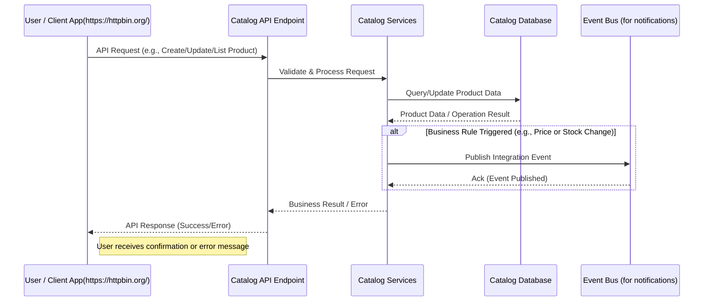
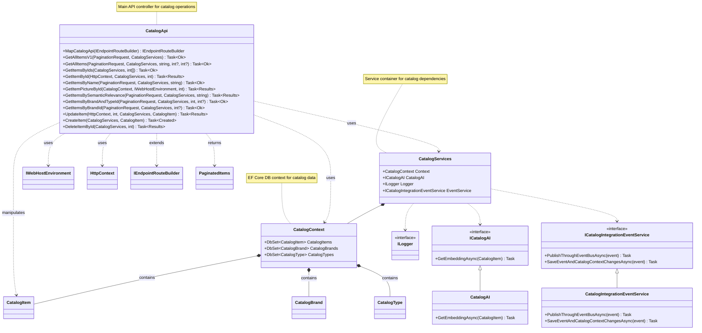

# eShop - Catalog HTTP API Documentation

## 1. Feature Overview

### Purpose
The Catalog API is a Data-Driven/CRUD microservice that manages the product catalog functionality in the eShop application. It serves as the central repository for all product-related information.

### Business Motivation
- Enable efficient product catalog management
- Support dynamic product searches and filtering
- Provide seamless integration with other eShop services
- Enable real-time product updates and inventory management

### Key Stakeholders
- Store administrators (catalog management)
- Customers (product browsing and search)
- Other microservices (basket, ordering)
- Mobile and web applications

## 2. Business Implementation Details

### Business Flow Sequence Diagram


### Business Rules
1. Product Management
   - Each product must have a unique identifier
   - Products are categorized by type and brand
   - Products maintain inventory tracking (available stock, restock threshold)

2. Catalog Organization
   - Products are organized by types and brands
   - Support for pagination to handle large catalogs
   - Products can be searched by name, type, or brand

3. Pricing and Stock
   - Price changes trigger notifications to other services
   - Stock thresholds for reordering
   - Maximum stock limits enforcement

### Use Cases
1. Product Browsing
   - List all products with pagination
   - Filter products by type and brand
   - Search products by name
   - View detailed product information

2. Catalog Management
   - Add new products
   - Update existing products
   - Manage product images
   - Delete products

3. Inventory Control
   - Track available stock
   - Monitor restock thresholds
   - Manage maximum stock levels

## 3. Technical Implementation Details

### API Endpoints

#### Product Management
```
GET /api/catalog/items
- Lists catalog items with pagination
- Parameters: PageSize, PageIndex, name, type, brand
- Returns: PaginatedItems<CatalogItem>

GET /api/catalog/items/{id}
- Gets a specific catalog item
- Parameters: id
- Returns: CatalogItem

POST /api/catalog/items
- Creates a new catalog item
- Body: CatalogItem
- Returns: 201 Created

PUT /api/catalog/items/{id}
- Updates an existing catalog item
- Parameters: id
- Body: CatalogItem
- Returns: 201 Created

DELETE /api/catalog/items/{id}
- Deletes a catalog item
- Parameters: id
- Returns: 204 No Content
```

#### Category Management
```
GET /api/catalog/catalogtypes
- Lists all catalog types
- Returns: List<CatalogType>

GET /api/catalog/catalogbrands
- Lists all catalog brands
- Returns: List<CatalogBrand>
```

#### Advanced Search
```
GET /api/catalog/items/withsemanticrelevance
- Searches items using AI-powered semantic relevance
- Parameters: text
- Returns: PaginatedItems<CatalogItem>

GET /api/catalog/items/type/{typeId}/brand/{brandId}
- Filters items by type and brand
- Parameters: typeId, brandId (optional)
- Returns: PaginatedItems<CatalogItem>
```

### Key Components

#### Models
1. CatalogItem
```csharp
class CatalogItem {
    int Id
    string Name
    string Description
    decimal Price
    string PictureFileName
    int CatalogTypeId
    int CatalogBrandId
    int AvailableStock
    int RestockThreshold
    int MaxStockThreshold
}
```

2. CatalogServices
```csharp
class CatalogServices {
    CatalogContext Context
    CatalogAI CatalogAI
    ILogger Logger
    IEventService EventService
}
```

### Class Dependency Diagram



### Integration Points
1. EventBus Integration
   - ProductPriceChangedIntegrationEvent for price updates
   - Integration with RabbitMQ for event publishing

2. AI Integration
   - Semantic search capabilities
   - Product embedding generation

## 4. Validation and Error Handling

### Input Validation
- Required fields validation
- Data type validation
- Business rule validation (stock thresholds, pricing)

### Error Scenarios
- 400 Bad Request: Invalid input
- 404 Not Found: Resource not found
- 500 Internal Server Error: Server-side issues

### Error Response Format
```json
{
    "type": "https://tools.ietf.org/html/rfc7231#section-6.5.1",
    "title": "Bad Request",
    "status": 400,
    "detail": "Error description"
}
```

## 5. Security and Access Control

### Authentication
- API version validation
- OAuth2/JWT authentication
- Integration with Identity.API

### Authorization
- Role-based access control
- Resource-level permissions
- API scope validation

## 6. Testing Strategy

### Test Categories
1. Unit Tests
   - Controller logic
   - Service layer
   - Model validation

2. Integration Tests
   - Database operations
   - Event publishing
   - External service integration

3. API Tests
   - Endpoint functionality
   - Response validation
   - Error handling

### Test Tools
- xUnit for unit testing
- EF Core InMemory for data layer testing
- API test client for endpoint testing

## 7. Deployment Considerations

### API Versioning
- Supports multiple API versions (v1.0, v2.0)
- Version-specific endpoints and features
- Backward compatibility maintenance

### Configuration
- Environment-specific settings
- Database connection configuration
- Event bus configuration
- AI service configuration

### Monitoring
- Request/response logging
- Performance metrics
- Error tracking
- Integration event monitoring

## 8. References

### Documentation
- [API Specification (v1)](./Catalog.API.json)
- [API Specification (v2)](./Catalog.API_v2.json)
- [Sequence Diagrams](./README.md)

### Source Code
- [CatalogApi.cs](./Apis/CatalogApi.cs)
- [CatalogContext.cs](./Infrastructure/CatalogContext.cs)
- [CatalogServices.cs](./Model/CatalogServices.cs)

### Integration Events
- [ProductPriceChangedIntegrationEvent.cs](./IntegrationEvents/Events/ProductPriceChangedIntegrationEvent.cs)
