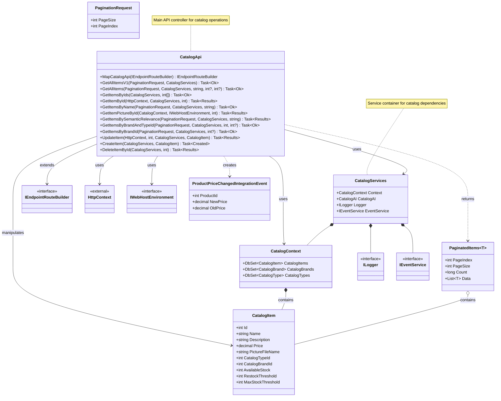

## API Request Sequence Diagram

The following sequence diagram illustrates the flow of a typical API request (e.g., `PUT /api/catalog/items/{id}` → `UpdateItem`) through internal class dependencies and external systems:


## CatalogApi Class Dependency Diagram


## API Request Sequence Diagram

The following sequence diagram illustrates the flow of a typical API request (e.g., `PUT /api/catalog/items/{id}` → `UpdateItem`) through internal class dependencies and external systems:

```mermaid
sequenceDiagram
    participant Client
    participant CatalogApi
    participant CatalogServices
    participant CatalogContext
    participant Database
    participant CatalogAI
    participant EventService
    participant EventBus

    Client->>CatalogApi: PUT /api/catalog/items/{id}
    CatalogApi->>CatalogServices: (injected)
    CatalogApi->>CatalogContext: Context.CatalogItems.SingleOrDefaultAsync(id)
    CatalogContext->>Database: Query CatalogItems by id
    Database-->>CatalogContext: CatalogItem
    CatalogContext-->>CatalogApi: CatalogItem
    CatalogApi->>CatalogAI: GetEmbeddingAsync(catalogItem)
    CatalogAI-->>CatalogApi: Embedding
    CatalogApi->>CatalogContext: SaveChangesAsync()
    CatalogContext->>Database: UPDATE CatalogItem
    Database-->>CatalogContext: Success
    alt Price Changed
        CatalogApi->>EventService: SaveEventAndCatalogContextChangesAsync(event)
        EventService->>Database: Save IntegrationEvent
        CatalogApi->>EventService: PublishThroughEventBusAsync(event)
        EventService->>EventBus: Publish ProductPriceChangedIntegrationEvent
        EventBus-->>EventService: Ack
    end
    CatalogApi-->>Client: 201 Created

    %% Clickable participants (class blocks)
    click CatalogApi "./Apis/CatalogApi.cs" "View CatalogApi.cs"
    click CatalogServices "./Model/CatalogServices.cs" "View CatalogServices.cs"
    click CatalogContext "./Infrastructure/CatalogContext.cs" "View CatalogContext.cs"
    click CatalogAI "./Services/CatalogAI.cs" "View CatalogAI.cs"
    click EventService "#" "[external or not found]"
    click EventBus "#" "[external or not found]"
    %% Clickable method calls (lines)
    %% (Mermaid does not support clickable lines/arrows, only blocks/participants)
```

## CatalogApi Class Dependency Diagram

```mermaid
classDiagram
    %% Core Classes
    class CatalogApi {
        +MapCatalogApi(IEndpointRouteBuilder) IEndpointRouteBuilder
        +GetAllItemsV1(PaginationRequest, CatalogServices) Task~Ok~
        +GetAllItems(PaginationRequest, CatalogServices, string, int?, int?) Task~Ok~
        +GetItemsByIds(CatalogServices, int[]) Task~Ok~
        +GetItemById(HttpContext, CatalogServices, int) Task~Results~
        +GetItemsByName(PaginationRequest, CatalogServices, string) Task~Ok~
        +GetItemPictureById(CatalogContext, IWebHostEnvironment, int) Task~Results~
        +GetItemsBySemanticRelevance(PaginationRequest, CatalogServices, string) Task~Results~
        +GetItemsByBrandAndTypeId(PaginationRequest, CatalogServices, int, int?) Task~Ok~
        +GetItemsByBrandId(PaginationRequest, CatalogServices, int?) Task~Ok~
        +UpdateItem(HttpContext, int, CatalogServices, CatalogItem) Task~Results~
        +CreateItem(CatalogServices, CatalogItem) Task~Created~
        +DeleteItemById(CatalogServices, int) Task~Results~
    }
    click CatalogApi "./Apis/CatalogApi.cs" "View CatalogApi.cs"

    %% Models and Dependencies
    class CatalogItem {
        +int Id
        +string Name
        +string Description
        +decimal Price
        +string PictureFileName
        +int CatalogTypeId
        +int CatalogBrandId
        +int AvailableStock
        +int RestockThreshold
        +int MaxStockThreshold
    }
    click CatalogItem "./Model/CatalogItem.cs" "View CatalogItem.cs"

    class CatalogServices {
        +CatalogContext Context
        +CatalogAI CatalogAI
        +ILogger Logger
        +IEventService EventService
    }
    click CatalogServices "./Model/CatalogServices.cs" "View CatalogServices.cs"

    class PaginationRequest {
        +int PageSize
        +int PageIndex
    }
    click PaginationRequest "./Model/PaginationRequest.cs" "View PaginationRequest.cs"

    class PaginatedItems~T~ {
        +int PageIndex
        +int PageSize
        +long Count
        +List~T~ Data
    }
    click PaginatedItems "./Model/PaginatedItems.cs" "View PaginatedItems.cs"

    %% External Dependencies
    class IEndpointRouteBuilder {
        <<interface>>
    }
    
    class HttpContext {
        <<external>>
    }

    class IWebHostEnvironment {
        <<interface>>
    }

    class CatalogContext {
        +DbSet~CatalogItem~ CatalogItems
        +DbSet~CatalogBrand~ CatalogBrands
        +DbSet~CatalogType~ CatalogTypes
    }
    click CatalogContext "./Infrastructure/CatalogContext.cs" "View CatalogContext.cs"

    class ILogger {
        <<interface>>
    }

    class IEventService {
        <<interface>>
    }

    class ProductPriceChangedIntegrationEvent {
        +int ProductId
        +decimal NewPrice
        +decimal OldPrice
    }
    click ProductPriceChangedIntegrationEvent "./IntegrationEvents/Events/ProductPriceChangedIntegrationEvent.cs" "View ProductPriceChangedIntegrationEvent.cs"

    %% Relationships
    CatalogApi --> CatalogServices : uses
    CatalogApi --> CatalogContext : uses
    CatalogApi --> IWebHostEnvironment : uses
    CatalogApi --> CatalogItem : manipulates
    CatalogApi --> HttpContext : uses
    CatalogApi --> IEndpointRouteBuilder : extends
    CatalogApi ..> ProductPriceChangedIntegrationEvent : creates
    CatalogApi ..> PaginatedItems : returns

    CatalogServices *-- CatalogContext
    CatalogServices *-- ILogger
    CatalogServices *-- IEventService

    CatalogContext *-- CatalogItem : contains
    
    PaginatedItems o-- CatalogItem : contains

    %% Notes for clarity
    note for CatalogApi "Main API controller for catalog operations"
    note for CatalogServices "Service container for catalog dependencies"
```
